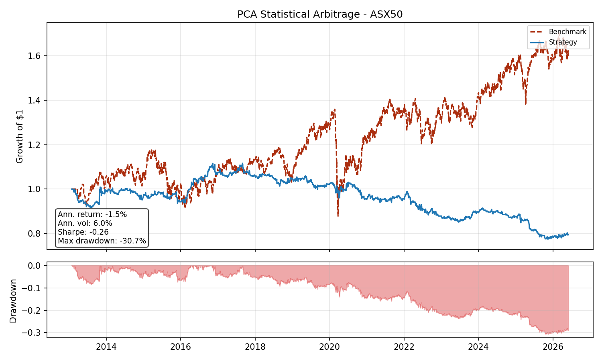
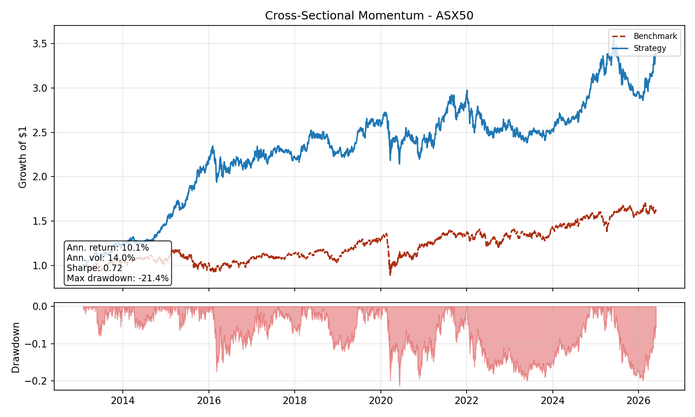

# algothon_asx
Application of 2026 SIG Algothon strategy and code to Australian equities.

This project incorporates a PCA statistical arbitrage strategy, a momentum trading strategy, all
combining into a risk engine which utilises a Hidden Markov Model (HMM) to size positions and to allocate
capital between strategies, along with beta hedging of the overall book. 

This project was made between myself (SRem-07) and PhoenixBlazer(https://github.com/phoenixblazer)

## Strategy 1: PCA Statistical Arbitrage

A cross-sectional mean-reversion strategy on the ASX200. Common (market/sector) risk is
stripped out of each stock's returns via PCA, and the leftover idiosyncratic residual is
tested for mean-reversion and traded via an Ornstein-Uhlenbeck (OU) framework, in the
spirit of Avellaneda & Lee (2010). Implementation: [stat_arb.py](stat_arb.py).

### 1. Standardising returns

Daily log returns are computed and standardised (zero mean, unit variance) over a trailing
`fit_window` (default 252 days), so PCA isn't dominated by whichever stocks happen to have
the highest raw volatility:

$$r_{i,t} = \ln\left(\frac{P_{i,t}}{P_{i,t-1}}\right), \qquad z_{i,t} = \frac{r_{i,t} - \bar{r}_i}{\sigma_i}$$

### 2. Factor decomposition and residuals

PCA is fit on the standardised return matrix $Z$ (days $\times$ stocks). Rather than fixing
the number of components $k$, $k$ is chosen as the smallest number of components
whose cumulative explained variance clears a target threshold $\tau$ (default 55%):

$$k = \min\left\lbrace k : \sum_{j=1}^{k} \lambda_j \Big/ \sum_{j=1}^{N} \lambda_j \geq \tau \right\rbrace$$

where $\lambda_j$ are the PCA eigenvalues. A fixed $k$ risks either under-fitting 
common structure or over-fitting sample noise as the number of names or the fit window
changes; a variance-explained target adapts to how much real common structure is actually
present in the current window. The top $k$ components are treated as systematic risk;
what's left is the idiosyncratic residual for each stock:

$$\hat{Z} = F W, \qquad \epsilon_{i,t} = Z_{i,t} - \hat{Z}_{i,t}$$

### 3. Fitting the OU process

The daily residual $\epsilon_{i,t}$ is itself stationary by construction (it's already a
return), so testing it directly for mean-reversion is uninformative. Instead, its
cumulative sum over the trailing `mr_window` (default 60 days) is treated as a synthetic
"price" for the idiosyncratic component — this is the object that can actually wander from
equilibrium and revert:

$$X_{i,t} = \sum_{s=1}^{t} \epsilon_{i,s}$$

$X_t$ is tested for a unit root (ADF) and fit with an AR(1) regression, which maps onto
standard OU parameters in closed form:

$$X_t = a + b X_{t-1} + \zeta_t$$

$$\kappa = -\ln(b), \qquad \text{half-life} = \frac{\ln 2}{\kappa}, \qquad m = \frac{a}{1-b}, \qquad \sigma_{eq} = \frac{\sigma_\zeta}{\sqrt{1 - b^2}}$$

$$s = \frac{X_t - m}{\sigma_{eq}}$$

A stock only continues to the signal stage if it passes both gates: the ADF p-value is
below `adf_pvalue_threshold`, and the fitted half-life falls inside
`[min_half_life, max_half_life]` — fast enough to plausibly revert within the trading
horizon, but slow enough that it isn't noise.

### 4. From s-score to conviction

The end goal is a continuous per-stock conviction in $[-1, 1]$, not a flat $\pm 1$ trigger —
a binary signal throws away information the OU fit already produced. Two stocks that both
clear the entry threshold are not necessarily equally good trades: one might have $p = 0.001$ and a
half-life sitting dead-center of the tradeable band, the other might just scrape under the
p-value threshold with a half-life on the edge of the band. Conviction is built as a
product of three independent confidence terms, all scaled to $[0, 1]$, so a stock only
gets a strong signal when it is significant, well-behaved, and meaningfully displaced
from equilibrium all at once. Weakness on any one dimension damps the conviction rather than
either fully including or fully excluding the trade:

$$\text{conviction}_i = -\text{sign}(s_i) \cdot \phi(s_i) \cdot \psi(p_i) \cdot \chi(h_i)$$

**Distance from equilibrium**, ramped between the exit and entry z-scores rather than
switched on abruptly at entry:

$$\phi(s) = \text{clip}\left(\frac{\min(|s|,\ z_{max}) - z_{exit}}{z_{entry} - z_{exit}},\ 0,\ 1\right)$$

**Statistical confidence**, so a stock that barely clears the ADF threshold contributes
less than one that's strongly significant:

$$\psi(p) = \text{clip}\left(1 - \frac{p}{p_{thresh}},\ 0,\ 1\right)$$

**Half-life fitness**, a triangular weight peaking at the midpoint of
`[min_half_life, max_half_life]` and decaying toward the edges of the band, since a
half-life just inside the boundary is a weaker signal than one near the middle:

$$\chi(h) = \begin{cases} \dfrac{h - h_{min}}{h_{mid} - h_{min}} & h \leq h_{mid} \\[6pt] \dfrac{h_{max} - h}{h_{max} - h_{mid}} & h > h_{mid} \end{cases}$$

As all terms are multiplied rather than summed or averaged, any one of them
collapsing to zero (e.g. failing significance) zeroes the whole conviction. The resulting per-stock conviction
is designed to combine with a momentum-based conviction score and feed a regime-detecting
HMM that ultimately sizes positions.

### Backtest

Run on the ASX200 universe with EWMA vol-scaled residuals, a 70% cumulative
variance target for PCA, a 90-day OU/ADF window with ADF p-value threshold 0.01,
and a 10-day rebalance.

| Metric | Value |
|---|---|
| Annualised return | 6.0% |
| Annualised volatility | 8.6% |
| Sharpe | 0.69 |
| Max drawdown | -16.7% |

<!-- TODO: discussion of results, limitations, and next steps goes here -->

### Backtesting tools

- [backtest/backtester.py](backtest/backtester.py) — walk-forward backtester, driven by any
  strategy exposing `_signal(price_data) -> pd.Series` (ticker → conviction), so it works
  unmodified for the momentum strategy since it shares this interface.
- [backtest/walk_forward_validator.py](backtest/walk_forward_validator.py) — out-of-sample
  hyperparameter validation: sweeps a parameter grid, and for each sequential
  out-of-sample block, selects the best-scoring combination using only data available
  before that block.
- [backtest/run_stat_arb_backtest.py](backtest/run_stat_arb_backtest.py) — runnable script
  that produces the PCA stat-arb plot above.
- [backtest/run_momentum_backtest.py](backtest/run_momentum_backtest.py) — runnable script
  that produces the momentum plot below.

## Strategy 2: Cross-Sectional Momentum

A cross-sectional momentum strategy on the ASX50, exposing the same
`_signal(price_data) -> pd.Series` interface as the PCA stat-arb book so both strategies
plug into a shared risk-engine. 

### 1. Formation-window return

At each rebalance date, each stock is scored by its total return over a trailing
`lookback - skip` window that *ends* `skip` days before the rebalance. The most recent
`skip` days are deliberately dropped to sidestep the well-documented short-term reversal
effect that contaminates raw 12-month momentum with 1-month noise (Jegadeesh & Titman,
1993; the classic "12-1" formation window uses `lookback = 252`, `skip = 21`):

$$m_{i,t} = \frac{P_{i,\ t - \text{skip}}}{P_{i,\ t - \text{lookback}}} - 1$$

### 2. Cross-sectional ranking and quantile legs

Momentum is a relative statement, not absolute. In a bull market every stock has
positive trailing return, and in a drawdown every stock has negative trailing return, so
the direction of the trade has to come from a stock's rank inside the cross-section, not
its raw score. The universe is ranked by $m_{i,t}$; only names in the top `top_pct` (long
leg) and bottom `bottom_pct` (short leg) receive non-zero conviction, or are considered tradeable. Names in the middle
of the distribution are exactly the ones with no discriminating information, and are held
flat.

Within each leg, conviction ramps linearly from 0 at the quantile boundary to $\pm 1$ at
the extreme tail — the highest-ranked long name and the lowest-ranked short name carry
the most conviction, and names sitting on the edge of the quantile boundary get scaled
down toward zero. This preserves the sign information of the ranking while smoothing the
step function that a naive equal-weight top/bottom split would produce:

$$\text{rank\_conv}_i = \begin{cases} 1 - \dfrac{\text{rank}_i}{n_{\text{top}}} & \text{if } i \in \text{top } \text{top\_pct} \\[6pt] -\dfrac{n_{\text{bot}} - \text{rank}_i^{\text{asc}}}{n_{\text{bot}}} & \text{if } i \in \text{bottom } \text{bottom\_pct} \\[6pt] 0 & \text{otherwise} \end{cases}$$

### 3. Trend-quality scaling

Two stocks can have the exact same formation return but very different-looking price
paths. One may have drifted smoothly upward for eleven months, while the other might
have been flat for ten and jumped 30% in a single day. The formation return is identical,
but the first is a genuine momentum name and the second is much more likely to reverse.
To damp the second case, each name's conviction is scaled by the $R^2$ of a linear
regression of its **log price** on time over the formation window — a smooth trend has
$R^2 \to 1$, a jumpy or erratic path has $R^2 \to 0$:

$$R^2_i = 1 - \frac{\sum_t (\ln P_{i,t} - \widehat{\ln P}_{i,t})^2}{\sum_t (\ln P_{i,t} - \overline{\ln P_i})^2}$$

Log price is used rather than raw price so that a constant-growth-rate stock (which is
what a persistent momentum name looks like) sits exactly on a straight line, making the
$R^2$ a clean signal-to-noise measure for compounding trends.

The final per-stock conviction is the product of the two, clipped to $[-1, 1]$:

$$\text{rank\_conv}_i = \text{clip}\left(\text{rank\_conv}_i \cdot R^2_i,\ -1,\ 1\right)$$

Because the two terms multiply, a name has to be both in the tail of the cross-section
*and* on a clean trend to earn a meaningful position — either condition weakening damps
the conviction rather than forcing a binary in/out call. The output is the same
`pd.Series[ticker -> conviction in [-1, 1]]` format as the stat-arb signal, so the
Backtester's `_conviction_to_weights` handles gross-neutral normalisation and per-name
capping identically for both strategies.

### Backtest

| Metric | Value |
|---|---|
| Annualised return | 10.1% |
| Annualised volatility | 14.0% |
| Sharpe | 0.72 |
| Max drawdown | -21.4% |

